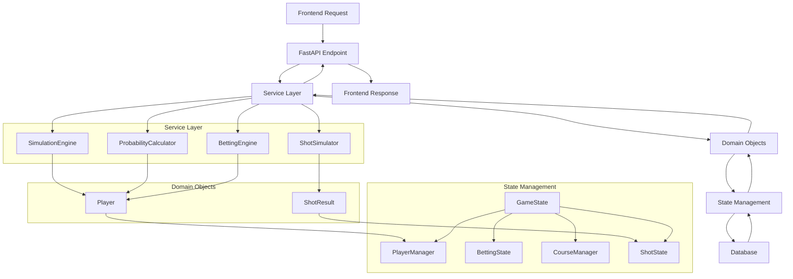

# 🏗️ Wolf Goat Pig - Class Relationship Diagram

## 📊 Complete Class Diagram

```mermaid
classDiagram
    %% ===== DOMAIN OBJECTS =====
    class Player {
        +String id
        +String name
        +Float handicap
        +Int points
        +String strength
        +Dict hole_scores
        +Bool float_used
        +Int last_points
        +get_handicap_category() HandicapCategory
        +get_strength_level() StrengthLevel
        +get_expected_drive_distance() Int
        +get_shot_quality_weights() List[Float]
        +add_points(points: Int) void
        +use_float() Bool
        +to_dict() Dict
        +from_dict(data: Dict) Player
    }

    class ShotResult {
        +Player player
        +Int drive
        +String lie
        +Int remaining
        +String shot_quality
        +Int penalty
        +Int hole_number
        +Int shot_number
        +Float wind_factor
        +Float pressure_factor
        +get_position_quality() Dict
        +get_scoring_probability() Dict
        +get_partnership_value() Dict
        +get_strategic_implications() Dict
        +get_shot_description() String
        +to_dict() Dict
        +from_dict(data: Dict) ShotResult
    }

    class HandicapCategory {
        <<enumeration>>
        SCRATCH
        LOW
        MID
        HIGH
        BEGINNER
    }

    class StrengthLevel {
        <<enumeration>>
        EXCELLENT
        GOOD
        AVERAGE
        BELOW_AVERAGE
        POOR
    }

    class ShotQuality {
        <<enumeration>>
        EXCELLENT
        GOOD
        AVERAGE
        POOR
        TERRIBLE
    }

    class LieType {
        <<enumeration>>
        FAIRWAY
        ROUGH
        SAND
        WATER
        OUT_OF_BOUNDS
    }

    %% ===== STATE MANAGEMENT =====
    class GameState {
        +PlayerManager player_manager
        +BettingState betting_state
        +CourseManager course_manager
        +ShotState shot_state
        +Int current_hole
        +Dict hole_scores
        +String game_status_message
        +Dict player_float_used
        +Bool carry_over
        +List hole_history
        +Dict _last_points
        +Dict tee_shot_results
        +setup_players(players: List, course_name: String) void
        +dispatch_action(action: String, payload: Dict) void
        +next_hole() void
        +calculate_hole_points() Dict
        +_serialize() Dict
        +_deserialize(data: Dict) void
    }

    class PlayerManager {
        +List[Player] players
        +List[String] hitting_order
        +String captain_id
        +setup_players(players: List[Player]) void
        +rotate_captain() void
        +get_player_by_id(player_id: String) Player
        +to_dict() Dict
        +from_dict(data: Dict) void
    }

    class BettingState {
        +Dict teams
        +Int base_wager
        +Bool doubled_status
        +String game_phase
        +request_partner(captain_id: String, partner_id: String) Dict
        +accept_partner(partner_id: String) Dict
        +go_solo(captain_id: String) Dict
        +offer_double(team_id: String) Dict
        +accept_double(team_id: String) Dict
        +reset() void
        +to_dict() Dict
        +from_dict(data: Dict) void
    }

    class CourseManager {
        +String selected_course
        +List[Int] hole_stroke_indexes
        +List[Int] hole_pars
        +List[Int] hole_yards
        +Dict course_data
        +load_course(course_name: String) void
        +get_hole_info(hole_number: Int) Dict
        +get_current_hole_info() Dict
        +get_courses() Dict
        +add_course(course_name: String, holes: List) void
        +delete_course(course_name: String) void
        +to_dict() Dict
        +from_dict(data: Dict) CourseManager
    }

    class ShotState {
        +String phase
        +Int current_player_index
        +List[ShotResult] completed_shots
        +List[Dict] pending_decisions
        +reset_for_hole() void
        +add_completed_shot(shot: ShotResult) void
        +get_current_player_id() String
        +to_dict() Dict
        +from_dict(data: Dict) void
    }

    %% ===== SERVICES =====
    class SimulationEngine {
        +List[ComputerPlayer] computer_players
        +setup_simulation(human_player: Dict, computer_configs: List, course_name: String) GameState
        +simulate_hole(game_state: GameState, human_decisions: Dict) Tuple
        +run_monte_carlo_simulation(...) MonteCarloResults
        +get_next_shot_event(game_state: GameState) Dict
        +execute_shot_event(game_state: GameState, shot_event: Dict) Tuple
        +_handicap_to_strength(handicap: Float) Int
        +_handicap_to_strength_string(handicap: Float) String
    }

    class ComputerPlayer {
        +String player_id
        +String name
        +Float handicap
        +String personality
        +should_accept_partnership(captain_handicap: Float, game_state: GameState) Bool
        +should_offer_double(game_state: GameState) Bool
        +should_accept_double(game_state: GameState) Bool
        +should_go_solo(game_state: GameState) Bool
        +_get_current_points(game_state: GameState) Int
        +_assess_hole_difficulty(game_state: GameState) Float
        +_assess_team_advantage(game_state: GameState) Float
        +_assess_individual_advantage(game_state: GameState) Float
    }

    class ShotSimulator {
        <<static>>
        +simulate_individual_tee_shot(player: Player, game_state: GameState) ShotResult
        +simulate_approach_shot(player: Player, distance: Int, game_state: GameState) ShotResult
        +simulate_player_score(handicap: Float, par: Int, hole_number: Int) Int
        +_calculate_drive_distance(handicap: Float, par: Int) Int
        +_determine_lie(shot_quality: String) String
        +_calculate_remaining_distance(drive: Int, total_yards: Int) Int
    }

    class ProbabilityCalculator {
        <<static>>
        +calculate_tee_shot_probabilities(player: Player, game_state: GameState) Dict
        +calculate_betting_probabilities(game_state: GameState, decision: Dict) Dict
        +calculate_scoring_probabilities(shot_result: ShotResult) Dict
        +_calculate_partnership_probabilities(game_state: GameState, decision: Dict) Dict
        +_calculate_solo_probabilities(game_state: GameState) Dict
    }

    class BettingEngine {
        <<static>>
        +check_betting_opportunity(game_state: GameState, shot_result: Dict) Dict
        +execute_betting_decision(game_state: GameState, decision: Dict, betting_probs: Dict) Tuple
        +make_computer_partnership_decision(captain: ComputerPlayer, partner: ComputerPlayer, game_state: GameState) Bool
        +_calculate_partnership_advantage(captain_id: String, partner_id: String, game_state: GameState) Float
    }

    class MonteCarloResults {
        +List[Dict] game_results
        +Dict statistics
        +add_game_result(final_scores: Dict) void
        +calculate_statistics() void
        +get_summary() Dict
    }

    %% ===== API MODELS =====
    class ShotEventResponse {
        +String status
        +Dict shot_event
        +Dict shot_result
        +Dict probabilities
        +Dict betting_opportunity
        +Dict game_state
        +Bool next_shot_available
    }

    class BettingDecisionResponse {
        +String status
        +Dict decision
        +Dict decision_result
        +Dict betting_probabilities
        +Dict game_state
    }

    class SimulationSetup {
        +Dict human_player
        +List[ComputerPlayerConfig] computer_players
        +String course_name
    }

    class ComputerPlayerConfig {
        +String id
        +String name
        +Float handicap
        +String personality
    }

    class HumanDecisions {
        +String action
        +String requested_partner
        +Bool offer_double
        +Bool accept_double
        +Bool accept_partnership
    }

    %% ===== DATABASE MODELS =====
    class Rule {
        +Int id
        +String title
        +String description
    }

    class Course {
        +Int id
        +String name
        +String description
        +Int total_par
        +Int total_yards
        +Float course_rating
        +Float slope_rating
        +JSON holes_data
        +String created_at
        +String updated_at
    }

    class GameStateModel {
        +Int id
        +JSON game_data
        +String created_at
        +String updated_at
    }

    class SimulationResult {
        +Int id
        +String simulation_type
        +JSON parameters
        +JSON results
        +String created_at
    }

    %% ===== RELATIONSHIPS =====
    
    %% Domain Object Relationships
    Player ||--o{ ShotResult : "creates"
    Player --> HandicapCategory : "has"
    Player --> StrengthLevel : "has"
    ShotResult --> ShotQuality : "has"
    ShotResult --> LieType : "has"

    %% State Management Relationships
    GameState ||--|| PlayerManager : "has"
    GameState ||--|| BettingState : "has"
    GameState ||--|| CourseManager : "has"
    GameState ||--|| ShotState : "has"
    PlayerManager ||--o{ Player : "manages"
    BettingState --> Player : "references"
    CourseManager --> Course : "manages"

    %% Service Relationships
    SimulationEngine ||--o{ ComputerPlayer : "creates"
    SimulationEngine --> GameState : "orchestrates"
    SimulationEngine --> ShotSimulator : "uses"
    SimulationEngine --> ProbabilityCalculator : "uses"
    SimulationEngine --> BettingEngine : "uses"
    SimulationEngine --> MonteCarloResults : "creates"
    
    ComputerPlayer --> Player : "extends"
    ShotSimulator --> Player : "simulates for"
    ShotSimulator --> ShotResult : "creates"
    ShotSimulator --> GameState : "uses"
    
    ProbabilityCalculator --> Player : "calculates for"
    ProbabilityCalculator --> GameState : "uses"
    ProbabilityCalculator --> ShotResult : "analyzes"
    
    BettingEngine --> GameState : "manages"
    BettingEngine --> ComputerPlayer : "decides for"
    BettingEngine --> BettingState : "updates"

    %% API Model Relationships
    ShotEventResponse --> GameState : "serializes"
    ShotEventResponse --> ShotResult : "includes"
    BettingDecisionResponse --> GameState : "serializes"
    BettingDecisionResponse --> BettingState : "includes"
    SimulationSetup --> ComputerPlayerConfig : "contains"
    HumanDecisions --> GameState : "affects"

    %% Database Model Relationships
    GameStateModel --> GameState : "persists"
    SimulationResult --> MonteCarloResults : "stores"
    Course --> CourseManager : "managed by"

    %% Inheritance Relationships
    ComputerPlayer --|> Player : "inherits"
```

## 🔄 **Data Flow Diagram**



## 🎯 **Key Architectural Patterns**

### **Composition Pattern**
- `GameState` composes multiple state managers
- Each state manager has a single responsibility
- Easy to test and maintain individual components

### **Service Layer Pattern**
- Business logic separated into focused services
- Services are stateless and reusable
- Clear separation between orchestration and implementation

### **Domain-Driven Design**
- Domain objects represent business concepts
- Rich behavior encapsulated in domain objects
- Clear boundaries between domain and infrastructure

### **Event-Driven Architecture**
- Simulation follows chronological flow
- State changes trigger events
- Loose coupling between components

This class diagram shows the complete object-oriented architecture of your Wolf Goat Pig application, making it easy to understand relationships and maintain consistency across the codebase. 